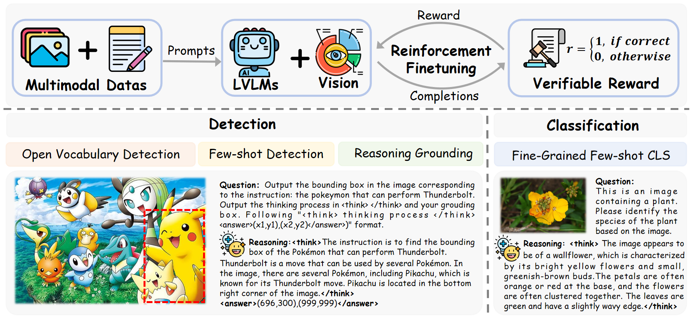
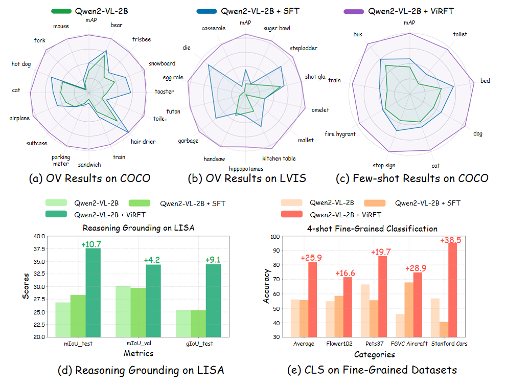
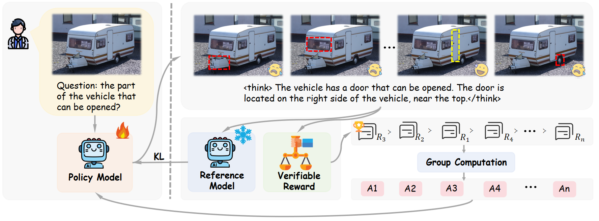

<p align="center">
  <h1 align="center"></h1>
  <h1 align="center">ViRFT: Visual Reinforcement Fine-tuning in Large Vision Language Models</h1>
    <p align="center">
    <a href="https://github.com/Liuziyu77"><strong>Ziyu Liu</strong></a>
    ·
    <a href="https://github.com/Liuziyu77"><strong>Zeyi Sun</strong></a>
    ·
    <a href="https://yuhangzang.github.io/"><strong>Yuhang Zang</strong></a>
    ·
    <a href="https://lightdxy.github.io/"><strong>Xiaoyi Dong</strong></a>
    ·
    <a href="https://panzhang0212.github.io/"><strong>Pan Zhang</strong></a>
    ·
    <a href="https://scholar.google.com/citations?user=sJkqsqkAAAAJ"><strong>Yuhang Cao</strong></a>
    ·
    <a href="https://kennymckormick.github.io/"><strong>Haodong Duan</strong></a>
    ·
     <a href="http://yjxiong.me/"><strong>Yuanjun Xiong</strong></a>
    ·
     <a href="http://dahua.site/"><strong>Dahua Lin</strong></a>
    ·
     <a href="https://myownskyw7.github.io/"><strong>Jiaqi Wang</strong></a>
  </p>
<!--   <h2 align="center">Accepted By ICLR 2025!</h2> -->
<!--   📖<a href="https://arxiv.org/abs/2410.17637">Paper</a> |🏠<a href="https://liuziyu77.github.io/MIA-DPO/">Homepage</a></h3>| -->
  🤗<a href="https://huggingface.co/collections/laolao77/virft-datasets-67bc271b6f2833eccc0651df">Huggingface</a></h3>
<div align="center"></div>
<p align="center">
  <p>
Visual preference alignment involves training Large Vision-Language Models (LVLMs) to predict human preferences between visual inputs. This is typically achieved by using labeled datasets of chosen/rejected pairs and employing optimization algorithms like direct preference optimization (DPO). Existing visual alignment methods, primarily designed for single-image scenarios, struggle to effectively handle the complexity of multi-image tasks due to the scarcity of diverse training data and the high cost of annotating chosen/rejected pairs. 
    
🌈We present Multi-Image Augmented Direct Preference Optimization (MIA-DPO), a visual preference alignment approach that effectively handles multi-image inputs. MIA-DPO mitigates the scarcity of diverse multi-image training data by extending single-image data with unrelated images arranged in grid collages or pic-in-pic formats, significantly reducing the costs associated with multi-image data annotations. Our observation reveals that attention values of LVLMs vary considerably across different images. We use attention values to identify and filter out rejected responses the model may have mistakenly focused on. Our attention-aware selection for constructing the chosen/rejected pairs without relying on (i) human annotation, (ii) extra data, and (iii) external models or APIs. MIA-DPO is compatible with various architectures and outperforms existing methods on five multi-image benchmarks, achieving an average performance boost of 3.0% on LLaVA-v1.5 and 4.3% on the recent InternLM-XC2.5. Moreover, MIA-DPO has a minimal effect on the model's ability to understand single images.  
  </p>
<!--     <a href="">
       
    </a> -->
<br>

<a href="">
  
</a>

## 📢 News
- 🚀 [02/25/2025] We release our paper.
- 🚀 [02/25/2025] We upload our training datasets to <a href="https://huggingface.co/collections/laolao77/virft-datasets-67bc271b6f2833eccc0651df">Huggingface</a></h3>.
- 🚀 [02/25/2025] We release **ViRFT** repository and our training code.

## 💡 Highlights
- 🔥 **Multi-Image Visual Alignment Pipeline**: We first design a multi-image visual alignment pipeline MIA-DPO. Our MIA-DPO requires no manual annotations and does not rely on APIs from larger models, offering a significant cost advantage compared to existing visual alignment approaches. 
- 🔥 **Observation on Multi-Image Hallucinations**: We contribute to the study of different types of multi-image hallucinations and propose to use attention values as an indicator for detecting multi-image hallucinations.
- 🔥 **Excellent Performance**:  MIA-DPO is agnostic to different LVLM architectures (LLaVA-v1.5 and InternLM-XC2.5, boosts the performance on multiple multi-image benchmarks while maintaining the original single-image understanding capabilities.


<a href="">
  
</a>

<a href="">
  
</a>

## 🛠️ Usage
### Setup
```
git clone https://github.com/Liuziyu77/ViRFT.git
conda create -n ViRFT python=3.10
conda activate ViRFT
bash setup.sh
```
