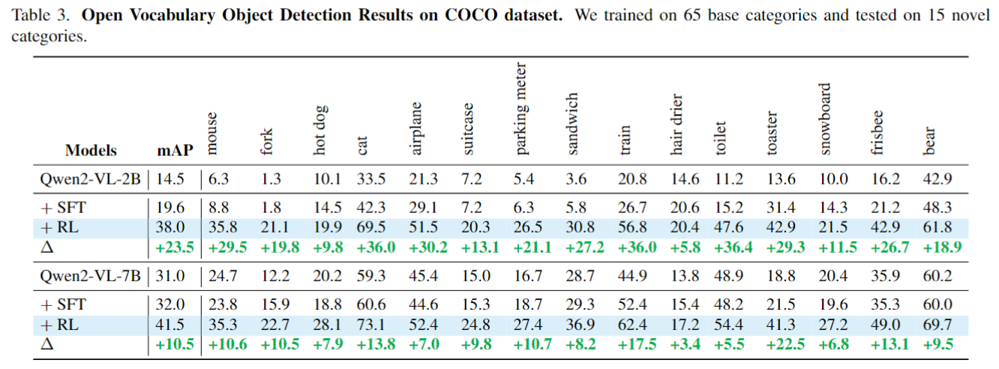
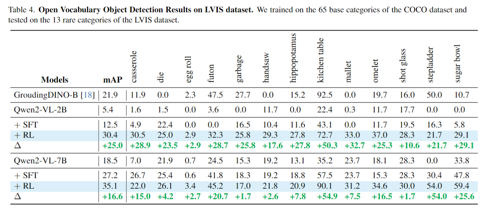

<p align="center">
  <h1 align="center"></h1>
  <h1 align="center">ViRFT: Visual Reinforcement Fine-tuning in Large Vision Language Models</h1>
    <p align="center">
    <a href="https://github.com/Liuziyu77"><strong>Ziyu Liu</strong></a>
    ·
    <a href="https://github.com/Liuziyu77"><strong>Zeyi Sun</strong></a>
    ·
    <a href="https://yuhangzang.github.io/"><strong>Yuhang Zang</strong></a>
    ·
    <a href="https://lightdxy.github.io/"><strong>Xiaoyi Dong</strong></a>
    ·
    <a href="https://panzhang0212.github.io/"><strong>Pan Zhang</strong></a>
    ·
    <a href="https://scholar.google.com/citations?user=sJkqsqkAAAAJ"><strong>Yuhang Cao</strong></a>
    ·
    <a href="https://kennymckormick.github.io/"><strong>Haodong Duan</strong></a>
    ·
     <a href="http://yjxiong.me/"><strong>Yuanjun Xiong</strong></a>
    ·
     <a href="http://dahua.site/"><strong>Dahua Lin</strong></a>
    ·
     <a href="https://myownskyw7.github.io/"><strong>Jiaqi Wang</strong></a>
  </p>
<!--   <h2 align="center">Accepted By ICLR 2025!</h2> -->
<!--   📖<a href="https://arxiv.org/abs/2410.17637">Paper</a> |🏠<a href="https://liuziyu77.github.io/MIA-DPO/">Homepage</a></h3>| -->
  🤗<a href="https://huggingface.co/collections/laolao77/virft-datasets-67bc271b6f2833eccc0651df">Huggingface</a></h3>
<div align="center"></div>
<p align="center">
  <p>
Visual preference alignment involves training Large Vision-Language Models (LVLMs) to predict human preferences between visual inputs. This is typically achieved by using labeled datasets of chosen/rejected pairs and employing optimization algorithms like direct preference optimization (DPO). Existing visual alignment methods, primarily designed for single-image scenarios, struggle to effectively handle the complexity of multi-image tasks due to the scarcity of diverse training data and the high cost of annotating chosen/rejected pairs. 
    
🌈We present Multi-Image Augmented Direct Preference Optimization (MIA-DPO), a visual preference alignment approach that effectively handles multi-image inputs. MIA-DPO mitigates the scarcity of diverse multi-image training data by extending single-image data with unrelated images arranged in grid collages or pic-in-pic formats, significantly reducing the costs associated with multi-image data annotations. Our observation reveals that attention values of LVLMs vary considerably across different images. We use attention values to identify and filter out rejected responses the model may have mistakenly focused on. Our attention-aware selection for constructing the chosen/rejected pairs without relying on (i) human annotation, (ii) extra data, and (iii) external models or APIs. MIA-DPO is compatible with various architectures and outperforms existing methods on five multi-image benchmarks, achieving an average performance boost of 3.0% on LLaVA-v1.5 and 4.3% on the recent InternLM-XC2.5. Moreover, MIA-DPO has a minimal effect on the model's ability to understand single images.  
  </p>
<!--     <a href="">
       
    </a> -->
<br>

<a href="">
  
</a>

## 📢 News
- 🚀 [02/25/2025] We release our paper.
- 🚀 [02/25/2025] We upload our training datasets to <a href="https://huggingface.co/collections/laolao77/virft-datasets-67bc271b6f2833eccc0651df">Huggingface</a>.
- 🚀 [02/25/2025] We release **ViRFT** repository and our training code.

## 💡 Highlights
- 🔥 **Multi-Image Visual Alignment Pipeline**: We first design a multi-image visual alignment pipeline MIA-DPO. Our MIA-DPO requires no manual annotations and does not rely on APIs from larger models, offering a significant cost advantage compared to existing visual alignment approaches. 
- 🔥 **Observation on Multi-Image Hallucinations**: We contribute to the study of different types of multi-image hallucinations and propose to use attention values as an indicator for detecting multi-image hallucinations.
- 🔥 **Excellent Performance**:  MIA-DPO is agnostic to different LVLM architectures (LLaVA-v1.5 and InternLM-XC2.5, boosts the performance on multiple multi-image benchmarks while maintaining the original single-image understanding capabilities.


<a href="">
  
</a>

<a href="">
  
</a>

## 🛠️ Setup
```
git clone https://github.com/Liuziyu77/ViRFT.git
conda create -n ViRFT python=3.10
conda activate ViRFT
bash setup.sh
```
## Training
### Datasets
To train on our various visual perception tasks, first visit <a href="https://huggingface.co/collections/laolao77/virft-datasets-67bc271b6f2833eccc0651df">Huggingface Datasets</a> to download the datasets. We have uploaded different datasets for different tasks.
| Datasets             |Task  |Setting          | Description                                                                 |
|------------------------------|------|----|-----------------------------------------------------------------------------|
| laolao77/ViRFT_COCO   |Detection | -                 | It includes all categories from COCO, with a total of 6k entries.            |
| laolao77/ViRFT_COCO_base65     | Detection |Open Vocabulary       | It includes 65 basic categories from COCO, with a total of 6k entries.      |
| laolao77/ViRFT_COCO_8_cate_4_shot |  Detection| Few-shot | It includes 8 selected categories from COCO.                                 |
| laolao77/ViRFT_LVIS_few_shot     |  Detection| Few-shot      | It includes 6 selected categories from COCO.                                 |
| laolao77/ViRFT_CLS_flower_4_shot |  Classification| Few-shot     | It includes the 102 categories from the Flower102 dataset, with 4 images per category. |
| laolao77/ViRFT_CLS_fgvc_aircraft_4_shot|  Classification| Few-shot | It includes the 100 categories from the FGVC-Aircraft dataset, with 4 images per category. |
| laolao77/ViRFT_CLS_car196_4shot   |  Classification| Few-shot   | It includes the 196 categories from the Stanford Cars dataset, with 4 images per category. |
| laolao77/ViRFT_CLS_pets37_4shot  |  Classification| Few-shot    | It includes the 37 categories from the Pets37 dataset, with 4 images per category. |
| LISA dataset | Grounding | - | Reasoning Grounding|
### GRPO
After downloading the dataset, you can start training using the following example bash script. Our bash scripts are in ```/src/scripts```
```
export DEBUG_MODE="true"
export LOG_PATH="./debug_log_2b_GRPO_coco_base65cate_6k.txt"

export DATA_PATH=./share_data/ViRFT_COCO_base65   ### your local dataset downloading from huggingface
export CKPT_PATH=./share_models/Qwen2-VL-2B-Instruct    ### Qwen2-VL-2B checkpoint path
export SAVE_PATH=./share_models/Qwen2-VL-2B-Instruct_GRPO_coco_base65cate_6k    ### save path

torchrun --nproc_per_node="8" \
    --nnodes="1" \
    --node_rank="0" \
    --master_addr="127.0.0.1" \
    --master_port="12345" \
    src/open_r1/grpo.py \
    --output_dir ${SAVE_PATH}  \
    --model_name_or_path ${CKPT_PATH} \
    --dataset_name ${DATA_PATH} \
    --deepspeed local_scripts/zero3.json \
    --max_prompt_length 1024 \
    --per_device_train_batch_size 1 \
    --gradient_accumulation_steps 2 \
    --logging_steps 1 \
    --bf16 \
    --report_to wandb \
    --gradient_checkpointing false \
    --attn_implementation flash_attention_2 \
    --max_pixels 401408 \
    --num_train_epochs 2 \
    --run_name Qwen2-VL-2B_GRPO_coco_base65cate_6k \
    --save_steps 100 \
    --save_only_model true \
    --num_generations 8 '
```

It is important to note that if you encounter an OOM (Out of Memory) issue during training, you can resolve it by configuring `zero3.json`. For the 7B model, if the issue persists after enabling `zero3.json`, you can try lowering the `num_generations` to 4.
```
--deepspeed ./local_scripts/zero3.json
```
### SFT
We use <a href="https://github.com/hiyouga/LLaMA-Factory">LLaMa-Factory</a> for supervised fine-tuning (SFT) of the model. You can convert the downloaded dataset into the corresponding Qwen SFT format for training.

## Evaluation
We conducted extensive experiments on various visual perception tasks, including fine-grained image classification, open vocabulary object detection, few-shot object detection, and reasoning grounding. **ViRFT** achieves remarkable performance improvements across these tasks with minimal data and computational cost, significantly surpassing supervised fine-tuning baselines.

The table below shows the test results of the model trained on the ViRFT_COCO_base65 dataset, evaluated on 15 new classes from the COCO dataset and 13 rare classes from the LVIS dataset.
<a href="">
  
</a>
<a href="">
  
</a>


